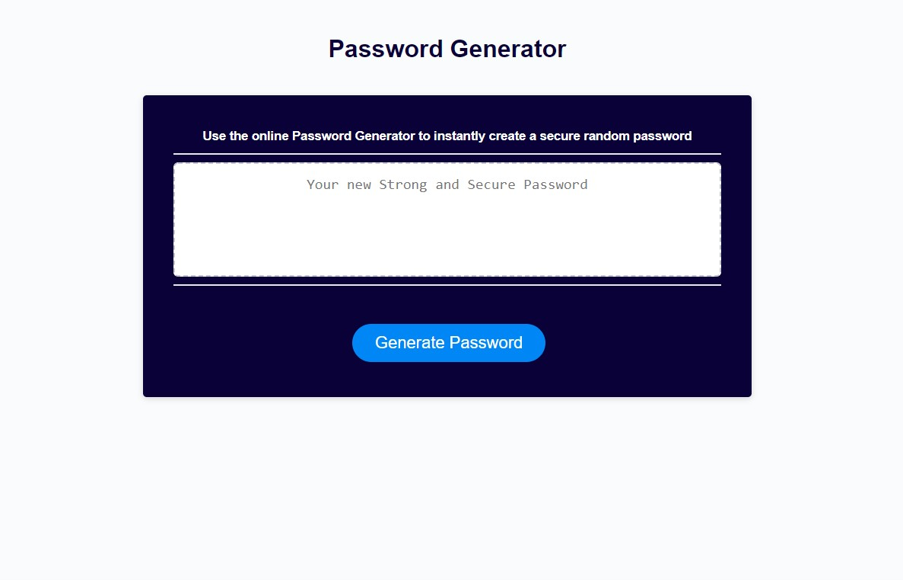

# [Password Generator](https://sheylapopovich.github.io/password-generator/) 

## Description 
This website was created by building on a starter code. It was styled by HTML and CSS, powered by JavaScript code. The application allows users to generate random passwords based on criteria that they have selected. 
The application will prompt the user to choose a password length of 8-128 characters. In addition, they will have to confirm through the window alerts if the password will consist of lowercase, uppercase, numeric, and/or special characters.
 Once the selections have been made a generated password will appear in the text box honoring their selection. Overall this project emphasizes the use of JavaScript to make dynamic changes to an HTML document.     

 

## Screenshot Final Project

 
 

 
## Links:
Deployed Application: [ Password Generator](https://sheylapopovich.github.io/password-generator/)

 

### This site was built using GitHub Pages.

 

  
